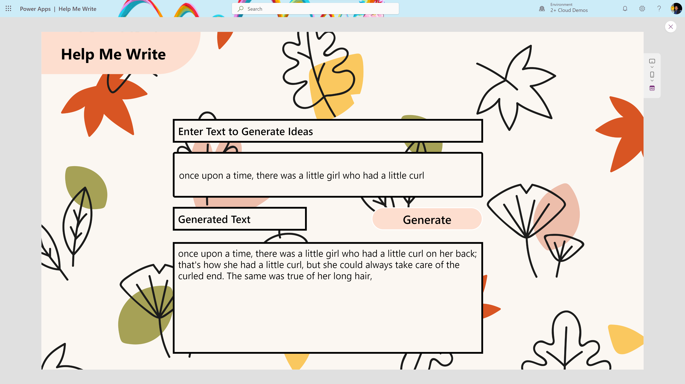

# Help Me Write - Azure ML + Power App Solution

Step-by-step guide on deploying a natural language processing machine learning model to the Azure platform and consuming it using Power Automate and Power Apps to generate text and give you creative writing ideas.

[Link Here](https://techcommunity.microsoft.com/t5/educator-developer-blog/deploying-a-large-language-model-gpt-2-on-azure-using-power/ba-p/3850661?wt.mc_id=studentamb_71460)

## Example

